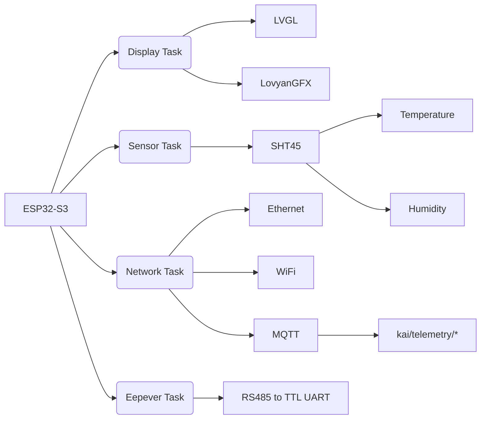

# KAI Monitoring Device

This is a repository for KAI Monitoring Device. Built using ESP-IDF v6 Framework.

> [!WARNING]
> This is still in active development!

## Program Tasks

## External Dependencies

- LovyanGFX
- LVGL

## Hardware Requirements

- Eepever 1210N (Through RJ45 RS485 Port)
- SHT45 Temperature and Humidity Sensor
- TTL to RS485 Module
- ST7796 + XPT2046 Resistive Touch LCD Display

## Todo List

- [ ] PCB Design and Printing
- [ ] Full 24h testing
- [ ] Code cleanup and proper documentation
- [ ] Code testing

## Credits

- Alexander Kuznetsov for YD ESP32-S3 Schematic and Footprint
